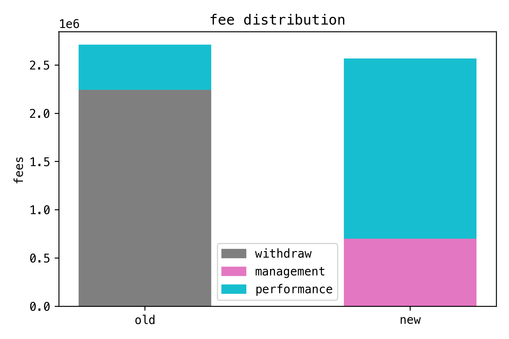

## Summary

- Focused proposal to set the fee structure for Vaults v2 to:
  1. No withdrawal fee
  2. Management fee (2%)
  3. Performance fee (20%)
- The proposal leaves:
  - Total fees collected at roughly the same level as for Vaults v1
  - Strategist reward allocation unchanged
  - YFI staking and rewards unchanged
  - Treasury management unchanged

## Background

The high level design of the next iteration of Yearn Vaults, v2, has been voted on and approved by YFI holders. It is currently in the later stages of the development cycle. Testing has begun, and security audits are in progress.

With the new vaults likely being weeks away from launch, it is high time to finalize how fees will be collected in them.

### Out of scope

There are currently active discussions underway in the community about many related topics, such as to what extent:

- Rewards should be distributed to YFI stakers 
- Strategist creators should be rewarded for their contributions
- Contributors should be allocated a portion of rewards for the purpose of long term incentivization 

Those questions are not answered by this proposal, and are not discussed further here. Specifically, anything that concerns what fees are spent on, how different stakeholders are compensated, or how the treasury should be run, is not covered by this proposal and is assumed to be unchanged.

### In scope

Instead, the focus here is to determine _how fees are collected_, and _the total amount collected_, with the intention to meet the following objectives:

- **Keep fees at roughly the same level.** The proposal should not lead to a significant change in the overall fee levels that are in place today with Vaults v1.
- Ensure fees incentivize the desired behavior among various stakeholders:
  - **Users** should be encouraged to keep funds in a vault if it performs well, and withdraw if the vault under-performs.
  - **Yearn** should be encouraged to design the best possible vaults, by ensuring rewards go up as a vault attracts and retains capital, and go down as capital leaves the vault. Similarly, rewards should increase if the vault performs well, and decrease if it under-performs.
  - **Third party integrations** should be encouraged to integrate Yearn vaults in their own products and services. It should be easy for them to reason about the expected behavior when depositing and withdrawing, and the fees charged by the vault.

## Motivation

### Previous fee structure, Vaults v1

- 5% performance fee, out of which
  - 4.5% went to Treasury
  - 0.5% went to the Strategist
- 0 to 0.5% withdrawal fee
  - 0% when funds were available in the Vault
  - 0.5% when funds had to be withdrawn from the Strategy

### Problems with a fee on withdrawals

- **Charges Users when they are the least happy with the vault.** You are charged a withdrawal fee when you no longer use the vault. If the vault performs, you would leave your funds in it and avoid paying for the service.
- **Rewards Yearn when there is capital flight.** More money leaving the vault leads to more fees, when it should be the opposite.
- **Can be gamed.** Astute users and integrations can time it so that they make free withdrawals in the period after the vault has seen deposits, as long as it's done before those funds have been sent to the Strategy for investing.
- **Makes fees unpredictable for integrations.** It's unclear what the fees charged will be prior to the actual withdrawal, making it harder for third party integrations to calculate ROI accurately.

### Benefits with a management fee

- **Continuous pay based on usage.** The vault provides a service that people are paying for, continuously, based on the time their capital is in the vault. There is no incentive to withdraw late or early.
- **Encourages optimizing for retention.** Yearn earns more fees when users keep funds in the vault, and makes less when they withdraw.
- **Benefits composability.** Makes it easier to integrate Vaults with other products and services.

### Comparing fees with v1

The backtesting data produced shows how the new fee model is delivering roughly the same amount of total fees, compared to the model used in Vaults v1:

|         | Withdrawal fee | Performance fee | Management fee |  Total fees |    % |
| ------- | -------------: | --------------: | -------------: | ----------: | ---: |
| **Old** |    \$2,243,078 |       \$466,822 |            N/A | \$2,709,900 | 100% |
| **New** |            N/A |     \$1,867,288 |      \$699,237 | \$2,566,525 |  95% |

#### Comments

- The previous withdrawal fee accounted for a whopping **83%** of all fees collected. This is very high for a fee that is unrelated to actual performance of the service.
- In contrast, the management fee in Vaults v2 would only account for **27%** of total fees.
- A much larger portion of fees are now made out of the performance fee component, **17%** of total fees in the old model, **73%** in the new model. This means that incentives are better aligned as Yearn earns most of it fees and Users pay most of their fees only if the Vaults are performing well.

## Specification

### New fee structure

- 0% withdrawal fee
- 2% annualized management
  - Full amount allocated to Treasury
  - Accrued per block
  - Collected on each harvest)
- 20% performance fee
  - 19.5% allocated to Treasury
  - 0.5% allocated to the Strategist (unchanged to v1)

## Vote

**For:** Release Vaults v2 with the proposed fee structure.

**Against:** Release Vaults v2 with some other fee to be defined fee structure.

## Metadata

| Name                | Value                                      |
| ------------------- | ------------------------------------------ |
| Proposed by         | 0x7A1057E6e9093DA9C1D4C1D049609B6889fC4c67 |
| Total for votes     | 1.77k YFI (99.74%)                         |
| Total against votes | 4.53 YFI (0.26%)                           |
| Start date          | Nov 7                                      |
| End date            | Nov 10                                     |

_Source: [Snapshot](https://snapshot.page/#/yearn/proposal/QmSaYHR97LDMDvg9xeTfdNZw6aqL9njxBKM6JVFtCYxKvB)_

## Copyright

Copyright and related rights waived via [CC0](https://creativecommons.org/publicdomain/zero/1.0/).
