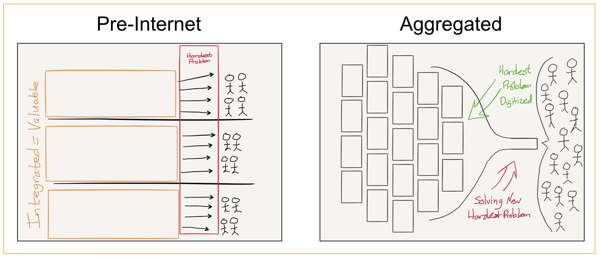
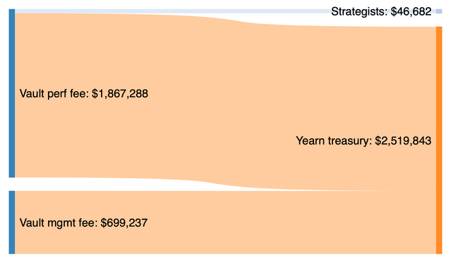
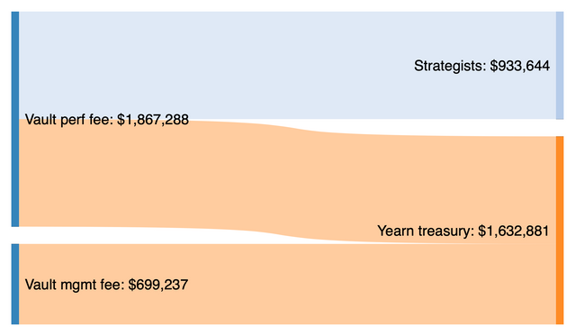

## Summary

- With 97.5% of the Vault's performance fee going to the Yearn treasury, Strategists have barely any skin in the game–**39x less than Yearn's Treasury** to be precise.
- Such a misaligned balance of interests does not make it attractive for Strategists to build on Yearn. This could turn into an **existential threat** to the protocol.
- This proposal sets Yearn and Strategists out to be **equal partners** in the success of a Vault, with each allocated an even share of the 20% performance fee:
  - Treasury allocation: 10%
  - Strategist: 10%

## Background

### What is Yearn's competitive edge?

#### Yearn as an aggregator

Yearn is often referred to as a "Yield aggregator", in the context of Ben Thompson's Aggregation Theory[[1]](#1).

Similar to Google for search, Facebook for social, Netflix for movies, Airbnb for holiday rentals, and Uber for rides, the idea is that Yearn should be the go-to source for users who want to earn the best and most predictable ROI on their DeFi investments.

Unlike these big tech companies however, there are some important differences in the case of Yearn as an aggregator:

- **The code base is open source.** If Yearn solves a hard problem, this means that others can now solve it too. The code base itself is not the competitive moat that it is for other aggregators. As we've seen it's straightforward to create forks/clones and launch competitors to Yearn.
- **There is no stickiness.** Aggregators have different degrees of stickiness. The Facebook Social Graph is extremely hard to replicate and makes it very difficult for users to switch to a competitor. While it's easy to switch to a Netflix competitor, they will miss out on exclusive original Netflix content so it comes at a cost. Uber's driver pool and Airbnb's housing stock is less unique and easier for its competitors to bootstrap or poach, but is still not trivial to replicate. Yearn on the other hand has no systemic stickiness. It does not even require canceling a subscription, or closing of an account. In the DeFi space, money flows to where it earns the best and most predictable returns.
- **What's on offer is ever changing and not easily commoditized.** The aggregators turn "the hardest problem digitized" into a commodity. For Facebook it is news articles and social content. For Netflix it's movies and tv-shows. In the case of Yearn, this would be yield-producing investment strategies. _But these cannot be easily commoditized:_
  - As soon as a strategy goes live, it can be replicated by competitors, thus affecting its performance.
  - As more capital flows into the strategy, it can become harder to realize the same opportunities, thus affecting its performance.
  - As time passes, a successful strategy will lose its alpha as the rest of the market adapts in response, thus affecting its performance.

#### Yearn's Gingerbread Man strategy

When Snap filed to go public, they wrote in their S-1 filing:

> In a world where anyone can distribute products instantly and provide them for free, the best way to compete is by innovating to create the most engaging products. That’s because it’s difficult to use distribution or cost as a competitive advantage—new software is available to users immediately, and for free. We believe this means that our industry favors companies that innovate, because people will use their products.

This triggered the same Ben Thompson to quip that Snap was pursuing a Gingerbread Man strategy[[2]](#2):

> Run, run, run as fast as you can.
> You’ll never catch me, I’m the gingerbread man.

This applies well to describe Yearn and the advantage it has over its competition. It's not the total value locked. It's not the APY returns. It's the ability to ship more innovating products, that are more secure and better performant than anything else on the market. This at a faster pace than the competition can keep up with and try to imitate.

#### Yearn's edge is the collective brain power it attracts and can retain building for it

If Yearn's business is aggregating yield-bearing strategies, its Strategy creators are the equivalent of Uber's drivers. **Strategy creators are however very different from Uber drivers.** They have much more unique skill sets, making them harder to replace, and more important to retain.

### A Strategist's choices

Someone who develops an investment strategy that results in a positive yield has the following choices today:

1. **Work for Yearn.** Partner up, work with protocol devs to integrate Strategy in a vault, hope for launch with a large influx of capital, be compensated as part of the performance.
2. **Create competing project or work for a competitor.** Either launch a competing project to Yearn, or work for an existing competitor, in the hopes of earning more fees.
3. **One man wolf pack it.** Deploy strategy solo, perhaps raising funds from friends and family, and keep all the fees.

In order for Yearn to remain competitive over the long term, the best and the brightest strategists must consistently choose to work with Yearn. This an existential question, necessary in order to ensure the long term sustainability of the protocol.

### How are strategists rewarded today?

The next version of Yearn vaults will launch with a two-pronged fee structure[[3]](#3):

1.  A 2% management fee levied on AUM that goes to the Treasury;
2.  A 20% performance fee levied on returns from the vault, which is split as follows:
    - 19.5% to the Treasury
    - **0.5% to the Strategy creator**

Strategists are expected to cover their own development, testing, gas, and monitoring costs. Under the current allocation, Strategists are not breaking even at times.[[4]](#4)

## Motivation

### Why not share the management fee?

- **The protocol requires predictable income.** There are a lot of constant costs on the protocol side. Operations, Development, maintenance, and R&D. These require a stable source of funding and should not be affected by Strategists.
- **Survival of the fittest.** Strategists should "eat what they kill", rewarding only the most ambitious and best performing, filtering out the rest.

### Why split the fee equally between Treasury and Strategists?

- **Establishes a partnership.** The message is clear: Yearn and Strategists are in this together, and it's a symbiotic relationship, where both are held accountable and are equally responsible for success.
- **Acquisition.** Creates success stories of high earning Strategists that will make it more aspirational and attractive for others to become Strategists.
- **Retention.** Strategists with a lot of skin in the game will work and further Yearn as opposed to a competitor.

### Future possibilities

**Tiered fee system.** As the Strategy creation space matures, there could be justification to distinguish between different qualities of strategies, creating a tiered system that rewards a different share of the performance fee based on the novelty and the sophistication of the strategy, as proposed in [[5]](#5). At this stage, it's recommended to keep a simple structure that is easy to reason about and for Strategists to understand the appeal of. This should be revisited in the future when needed.

### Comparing allocations

Drawing from the backtesting data produced in [[6]](#6), below is the Vaults V2 fee model applied to the yUSD vault, showing the difference in earnings between Strategists and Yearn treasury between allocation models.

#### Previous allocation

#### Proposed allocation

#### Comments

- The previous allocation to Strategists is disproportionately small compared to the value created by them.
- In the proposed allocation, the **Yearn treasury receives 64% of all fees** as it is paid the entirety of the management fee.
- The Strategist now earns a sizable reward that is entirely based on performance.

## Specification

### New performance fee structure

- 20% performance fee
  - 10% allocated to Treasury
  - 10% allocated to the Strategist

The Strategist is expected to pay for all expenses incurred, including those of development, testing, gas, monitoring, and operation.

## Vote

**For:** Accept proposal.

**Against:** Reject proposal.

## Metadata

| Name                | Value                                      |
| ------------------- | ------------------------------------------ |
| Proposed by         | 0x0Cec743b8CE4Ef8802cAc0e5df18a180ed8402A7 |
| Total for votes     | 1.34k YFI/yYFI (83.76%)                    |
| Total against votes | 260.13 YFI/yYFI (16.24%)                   |
| Start date          | Nov 9                                      |
| End date            | Nov 12                                     |

_Source: [Snapshot](https://snapshot.page/#/yearn/proposal/QmbAq6jPB6ocrihjkDo5TLNF4D4w9dw1HsEsJ7vwdwd9g3)_

## References

<a id="1">1. https://stratechery.com/concept/aggregation-theory/</a>
<a id="2">2. https://stratechery.com/2017/snaps-apple-strategy/</a>
<a id="3">3. https://snapshot.page/#/yearn/proposal/QmSaYHR97LDMDvg9xeTfdNZw6aqL9njxBKM6JVFtCYxKvB</a>
<a id="4">4. https://gov.yearn.finance/t/proposal-increase-strategist-rewards/7299/8</a>
<a id="5">5. https://gov.yearn.finance/t/proposal-increase-strategist-rewards/7299/10</a>
<a id="6">6. https://gov.yearn.finance/t/restructure-fees-and-align-incentives/</a>

## Copyright

Copyright and related rights waived via [CC0](https://creativecommons.org/publicdomain/zero/1.0/).
