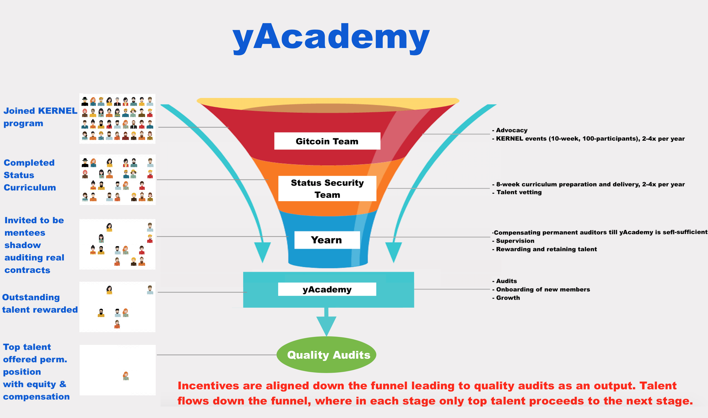

This is the culmination of efforts since the [original proposal](https://gov.yearn.finance/t/lets-poach-samczsun-and-plant-the-seed-for-an-auditing-academy/5507) which led to a partnership with our friends at [Gitcoin and Status](https://gitcoin.co/blog/announcing-the-kernel-security-track/) who also have been thinking about security in our ecosystem.

# Simple Summary

We launch the yAcademy: a security wing tasked with auditing Yearn's contracts, attracting and retaining top talent, and eventually generating revenue by expanding its auditing services to the ecosystem at large. Mission: audit Yearn contracts in a collaborative and semi-structured process. Administrative costs are kept near zero, as the tasks of advocacy, event organizing, educational curriculum are handled by our partners at Gitcoin and Status. The yAcademy is net positive from day one since money that would have otherwise been an operational expense given to auditing firms is now an investment that should pay back the principle immediately (in the form of audits of Yearn contracts) and generate revenue eventually (once the team has expanded to offer services to the ecosystem).

yAcademy will be operated as a joint venture by the yAcademy partners—Yearn (through the Multisig Council), Gitcoin, Status and member-auditors (including the first five auditors to join). The alignment can be seen in the following figure:

## _Glossary of terms_

- **_Stakeholders_**: Yearn (through the Multisig Council), Gitcoin, Status, yAcademy permanent members (auditors)
- **_Founding members_**: the first five auditors to join the yAcademy. They get membership interests in yAcademy.
- **_Mentees_**: outstanding participants in the KERNEL program that complete the curriculum and show promise, they are invited to shadow audit in yAcademy in close collaboration with Founding Members and Yearn core team.
- **_Membership Interests_**: non-transferable governance and economic rights in the yAcademy joint venture.

## Abstract

The Yearn technical community is innovating at a rapid speed. Efforts must be made to mitigate software bugs. Auditing talent is currently scarce and will continue to be for sometime because the pace of innovation in smart-contract products is much faster than that of producing auditors.

The Yearn community already expends a significant amount of time negotiating audit contracts or coordinating one-off informal audits. Planting the seed for an auditing wing of Yearn will bring immense benefits in the short and long term. Money spent on audits is a realized cost, while money spent on yAcademy is an investment. Yearn has thus far this year spent more on audits/bounties more than the projected budget for yAcademy. By keeping administrative costs near zero, the yAcademy should be a net positive to YFI holders from day one. If structured and run efficiently, we should witness the rise of a new breed of excellent auditors that get vetted by going through the KERNEL program run by our partners at Gitcoin and Status.

The Yearn community should incentivise rising stars to stay and continue to work on Yearn contracts full time. As Yearn matures over-time, yAcademy can begin to offer services to the outside world. At that point, the yAcademy becomes a self-sufficient, and potentially massively profitable. To align incentives, equity in the yAcademy is distributed to YFI holders (65%), Gitcoin (10%), Status (10%), and the first five permanent auditors (5%, 4%, 3%, 1.5%, 1.5% to the 1st, 2nd, 3rd, 4th, and 5th members respectively).

## Motivation

- Yearn is innovating at an ever increasing speed.

- Software bugs are a matter of "when" and "how bad", not "if". We must make mitigation efforts.

- Auditing firms are overbooked, they have financial incentive to speed up audits which can affect quality.

- Negotiating audit contracts with auditing firms is a laborious and clunky analog process.

- Audit contracts are very expensive.

- Yearn is a hub of innovation and as a result should attract top talent.

- Smart contracts will probably experience an even bigger cambrian explosion once the enterprise starts using permissionless networks such as Ethereum as a settlement layer. Hence, the yAdademy will most likely become a highly-profitable organization, thereby paying back all the investment put into it, and then some—this could lead to a new source of sustainable research & development funding for Yearn ecosystem grants.

- Yearn are better off having auditing expenditure be an investment that pays itself back and more, rather than a realized operational cost lost to auditing firms.

- Yearn has spent on security audits/bounties this year more than the projected budget for Yearn.

## Specification

The figure above summarizes the flow, responsibilities, and expectations.

### Overview

- The academy is governed by all of its stakeholders but not micro-managed. The day to day by the auditors themselves autonomously, in close collaboration with the Yearn core team and supervision of the multisig holders (with input from YFI holders).Gitcoin, and Status may get involved if major decisions are to be made.

- Start with 1 founding auditor, with the expectation to add 1-2 more at the end of each KERNEL-Curriculum-Shadowing iteration depicted in the figure above (2-4 iterations per year).

- Communication between auditors and mentees is kept as efficient as possible. No endless tm discussions, but rather a streamlined lines of communication using productivity software.

- Being a mentee in the yAcademy is trial-by-fire type of situation: mentees walk along the process of auditing a contract, receiving hints and/or assignments, results are shared in a certain format etc..

- Mentees join by invitation only, and are unpaid. A few select mentees are selected based from the cohort of ~100 participants in the KERNEL program, but may be invited from the outside as founding auditors, core team, and the community at large see fit.

- Mentees that show merit begin to receive rewards. If they continue shining, they may be extended an offer to become permanent members with competitive compensation and membership interests ( full membership interests to the first 5 founding members only).

- Yearn gets a 65% membership interest in the yAcademy in return for bootstrapping funding, sponsorship of KERNELs, and rewards to outstanding shadow auditors. The Yearn core team will be instrumental in the early stages of yAcademy to bring auditors up to speed and share their expertise. The remaining membership interests go 10% to Gitcoin, 10% to Status, and 15% to the first five founding members: 5%, 4%, 3%, 1.5%, and 1.5% to the 1st, 2nd, 3rd, 4th and 5th founding members, respectively.

### Rationale

- Traditional ways of education and collaboration are obsolete.

- Invitation-only is an efficiency measure, to make sure time and energy is not wasted hand-holding mentees. But anyone who shows interest and meets the basic minimal requirements should get an invitation.

- Merit-based: auditors that stick around and bring value are rewarded.

- Synchronous communication is inefficient.

- Some structure in the collaboration between mentors and mentees is needed to reduce time waste.

- No time is spent authoring and delivering educational materials: this is a trial-by-fire type of situation, mentees learn by walking along the auditing process of **real** contracts.

- Membership interests ensure incentive alignments and reduces bootstrapping operational costs to the absolute minimum. By granting membership interests to founding members, yAcademy can stay competitive with the industry standard while not allocating too much money on salaries. At the same time, auditors are incentivized to perform well since yAcademy's growth means the growth of their membership value.

### Short-term operational outlook (1-2 years)

We expect a budget of ~150-200k in the first year out of the Multisig Council treasury, covering the funding of 1-2 founding members and including mentee rewards and kernel sponsorship. The second year's budget will be decided when the time comes, but is expected to not exceed the first year's significantly because the founding members may by then have reached a level where they can take on outside contracts for a premium, which then goes back to funding the yAcademy itself.

yAcademy may go through iterations as we learn and adjust during the first 1-2 years. Current stakeholders all have a track record of being good actor in the ecosystem, and so the happy case outlined in the figure above has a good chance of squeezing out incredible value for the stakeholders and the ecosystem as a whole.

### Vote

**For**: Launch the yAcademy, allocate the budget, hire the first member, and start scouting for the second after the first KERNEL event Jan-Mar 2021.

**Against**: Do not launch yAcademy, keep the status quo of Yearn paying auditing firms and/or having the core team take on security and/or rely on white hackers to find bugs for bounties.

## Metadata

| Name                | Value                                      |
| ------------------- | ------------------------------------------ |
| Proposed by         | 0x7A1057E6e9093DA9C1D4C1D049609B6889fC4c67 |
| Total for votes     | 937.09 YFI (99.99%)                        |
| Total against votes | 0.1 YFI (0.01%)                            |
| Start date          | Nov 11                                     |
| End date            | Nov 14                                     |

_Source: [Snapshot](https://snapshot.page/#/yearn/proposal/QmPTAfJCq3UtFZqY3jdgNEJsxc6yuHwfESnQyjjkoccZrJ)_

## Copyright

Copyright and related rights waived via [CC0](https://creativecommons.org/publicdomain/zero/1.0/).
