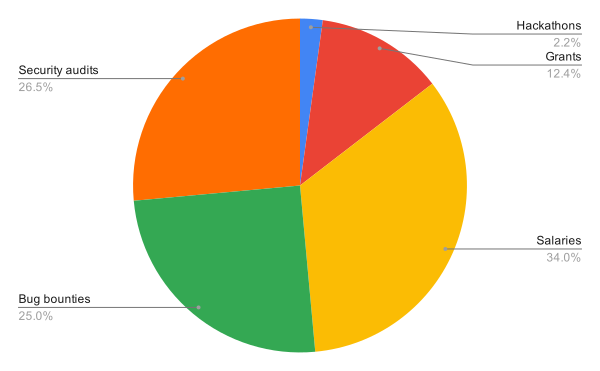
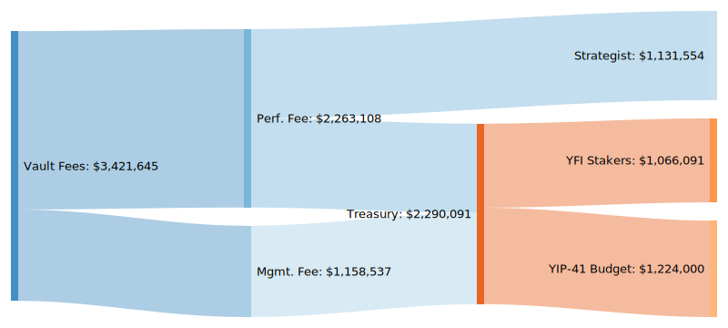
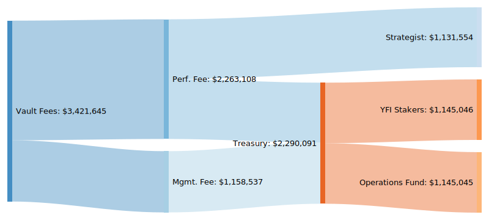

## Summary

- Transform the one-off YIP-41 budget into an Operations Fund that is allocated the same amount of funding on a continuous basis.
- Permit the Fund to **buy back YFI** or other assets at its discretion.
- Publish a quarterly report to make it easy for YFI holders to audit fund activities.
- This proposal supersedes the treasury cap of YIP-36 and the operations budget of YIP-41. Future changes can be made through additional YIPs.
- Together with the previously approved YIP-51 and YIP-52, this is the final piece in a trilogy of YIPs seeking to upgrade Yearn operations and financials.

## Background

As Yearn evolves, so does the need to cover operational expenses and quickly react to changes.

YIP-36[[1]](#1) laid the groundwork for Yearn operations funding. YIP-41[[2]](#2) extended this with the inclusion of a one-off operations budget. A forum thread envisioned the Multisig acting as an "operations special interest group"[[3]](#3). Today, there are multiple special interest groups (such as development, documentation, governance, branding/design, and communications) that are not directly related to the Multisig, but partly financed through the YIP-41 budget. The Multisig acts as an executor of the spending decisions of these groups.

This YIP builds on the previously adopted proposals to formalize a structure for sustainable funding of operations, to further Yearn's development and growth.

### Out of scope

The following questions are not covered:

- **How should YFI staking rewards be spent?** Proposals such as [[4]](#4) argue for a change in how staking rewards should be spent. This should be decided on separately by YFI voters.
- **How should spending decisions be made?** This proposal focuses on the funding of operations activities, and how these are reported transparently. Decision-making processes are assumed to be existing per YIP-41.
- **What is Yearn's long term governance structure?** YIP-41 temporarily empowers the Multisig while preparations are made for "a more robust governance architecture". Any material change to Yearn's governance would also need to consider the management of the Operations Fund.

### In scope

The proposal attempts to answer the following questions:

- **How do we sustainably fund operations over the longer term?** The budget in YIP-41 is one-off, for six months only. How do we ensure that operations activities are funded on an ongoing basis?
- **How do we reward contributors better?** Today, contributors are paid in yUSD. There's a desire to partially reward contributors in YFI as well, to give them skin in the game and a stake in the success of Yearn. With a fixed supply of YFI, there needs to be a way to acquire YFI to be used as such.
- **How do we keep accountability, without adding unnecessary overhead?** While we want sustainable funding and contributors to be empowered to act quickly and decisively, we also need to scrutinize spending decisions and hold those who make them accountable. Ideally this should be a simple process that avoids slowing down progress.

### Examples of Operations Expenditure

- **Security costs.** 3rd party audits, bug bounties, tools.
- **Contributor funding.** Recurring payments for full time contributors, one-off grants, bounties.
- **Third party products & services.** Freelancers, companies.
- **Running costs.** Gas expenditure, tools, equipment, infrastructure.

#### Current Yearn operations spend

Estimated to total ~\$434,000 as of November 10, 2020. More than half of the operations spend is security related, with the greater part of the remainder spent on funding contributors in various forms.



## Motivation

### Justifying the proposal

#### 1. Sizing the Operations Fund

The budget set in YIP-41 has so far been sufficient; there is no desire to increase it. Rather, the purpose is to transition from a one-off budget to a continuous funding process.

##### Approximating current allocation



The above diagram is based on data of the total fees collected by Yearn vaults in a four month period, from July 30 - Nov 05 2020.[[5]](#5)

The fees have then been allocated according to the new vault fee structure of YIP-51[[6]](#6) and the updated Strategist allocation of YIP-52[[7]](#7).

The current budget for operations is based off of the allocation in YIP-41[[2]](#2), calculated as:

```
(a) $ 500,000 + (b) 4 * $ 181,000 = $ 1,224,000
```

Where `(a)` is the bug bounty allocation, and `(b)` is four months worth of monthly operations expenses.

This gives an **approximation** of how rewards would be allocated today, based on YIP-41, -51, and -52. Roughly **53% of the treasury funds** would be allocated to Operations.

##### Proposed allocation

Based on this, the proposal is to round this number down to an **even 50%** and divide the Treasury funds equally between YFI staking rewards and Operations:



#### 2. Rewarding contributors

Paying a proportion of grants in YFI is an obvious and immediate way to give contributors a stake in the success of Yearn.

As the Treasury does not earn YFI, nor is it able to mint YFI, the straightforward way to acquire YFI is to **buy back YFI** with part of the Operations Fund.

Although this could incidentally have the added benefit of increasing buy demand for YFI, the purpose would not be to manipulate YFI price or to engineer long-term YFI price appreciation. Rather, the purpose would be to add YFI to the Operations Fund in order to reward contributors through YFI grants.

Rather than making an explicit pledge, or revealing a process that then is at risk of being exploited, it thought to be better to trial this on an ad-hoc basis. Exact capital allocations would be determined at the discretion of the Multisig based on various factors, including prevailing market conditions.

For instance, the recent negative downturn of the YFI price would have made an excellent buy opportunity for the Operations Fund.

As new Yearn products are introduced, so could the need emerge to buy back other assets than YFI. The Operations Fund therefore should have the right to buy any asset as required.

#### 3. Keeping contributors accountable

As operations move to continuous funding, tracking spending decisions and holding contributors accountable becomes ever more important.

This proposal does not introduce any new spending mechanisms. All spending is signed off by the Multisig, with activities already tracked and published in a dedicated repo, `/ychad-audit`[[8]](#8).

In addition, a quarterly Operations Fund Report will be published documenting the activities of the previous period, how funds were spent, the current health of the Operations Fund, and what the focus for the upcoming quarter will be. The report helps YFI holders to audit the fund, and intervene as required by passing a YIP with new fund guidelines.

### Alternatives considered

In addition to the above 50-50 split, the following alternative spending allocations were considered:

- **Allocating 100% of the management fee to the Operations Fund.** This would mean that 100% of the performance fee share would go to YFI stakers. This proposal would have meant a slightly larger Operations Fund, with income that would have been more predictable, as it would not be determined by actual vault performance but by total funds locked in Yearn.
- **Allocating 75% of the management fee to Operations, and 25% of the performance fee.** Similarly, this would add a bit of performance fee into the mix, but keep the majority of the funds assigned to Operations coming from the amount of capital held in the vaults.

While stability and predictability for the Operations Fund is desired, it is more important for contributors to have an equal amount of skin in the game as YFI stakers, even if this leads to a smaller budget if vaults underperform.

### Future possibilities

- **Long-term YFI vesting, or yVest.** An obvious next step would be to establish some form of vesting plan for YFI allocation for long-term contributors. This could be realized with a contributor vault that "dog foods" strategies.
- **Team Funds.** As teams mature, they could be allocated dedicated budgets from the Operations Fund, increasing decentralization and autonomy.
- **Financial planning and analysis.** As Operations continues to evolve, further planning, budgeting, and forecasting can be added when deemed necessary.

## Specification

1. Effective with the introduction of Vaults v2, allocate 50% of Treasury fees to an Operations Fund, with the other 50% distributed to YFI stakers.
2. Permit the Operations Fund to buy YFI or any other asset as required with its funds, and to include such in the assets at its disposal.
3. Produce quarterly financial reports of the Operations Fund activities and decisions.
4. As it goes in effect, the Operations Fund replaces the treasury cap of YIP-36 and the budget of YIP-41.
5. The Operations Fund, its asset purchase authorization, and the other matters contemplated herein are not permanent, and can be altered or replaced by YFI holders as required, through the passing of a new YIP.

## Vote

**For:** Yes, establish the Operations Fund.

**Against:** No, reject the proposal.

## Metadata

| Name                | Value                                      |
| ------------------- | ------------------------------------------ |
| Proposed by         | 0x0Cec743b8CE4Ef8802cAc0e5df18a180ed8402A7 |
| Total for votes     | 935.4 YFI/yYFI (99.85%)                    |
| Total against votes | 1.38 YFI/yYFI (0.15%)                      |
| Start date          | Nov 12                                     |
| End date            | Nov 15                                     |

_Source: [Snapshot](https://snapshot.page/#/yearn/proposal/QmW2ZPfGrcNxVLvT2jm9fmvNwQLD9PrdToQDU8DNPp6Ckg)_

## References

<a id="1">1. https://yips.yearn.finance/YIPS/yip-36</a>
<a id="2">2. https://yips.yearn.finance/YIPS/yip-41</a>
<a id="3">3. https://gov.yearn.finance/t/understanding-decentralization-prioritizing-an-operations-team/</a>
<a id="4">4. https://gov.yearn.finance/t/proposal-rethinking-capital-allocation/</a>
<a id="5">5. Dataset available on request</a>
<a id="6">6. https://snapshot.page/#/yearn/proposal/QmSaYHR97LDMDvg9xeTfdNZw6aqL9njxBKM6JVFtCYxKvB</a>
<a id="7">7. https://snapshot.page/#/yearn/proposal/QmbAq6jPB6ocrihjkDo5TLNF4D4w9dw1HsEsJ7vwdwd9g3</a>
<a id="8">8. https://github.com/iearn-finance/ychad-audit/tree/master/reports/financial</a>

## Copyright

Copyright and related rights waived via [CC0](https://creativecommons.org/publicdomain/zero/1.0/).
