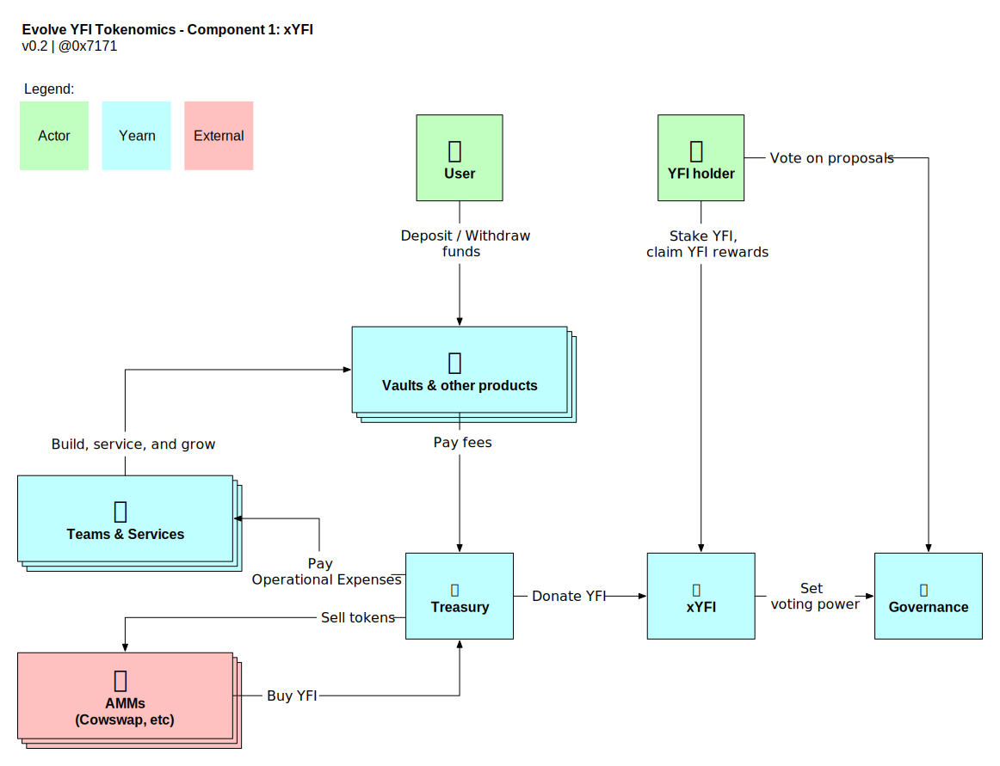
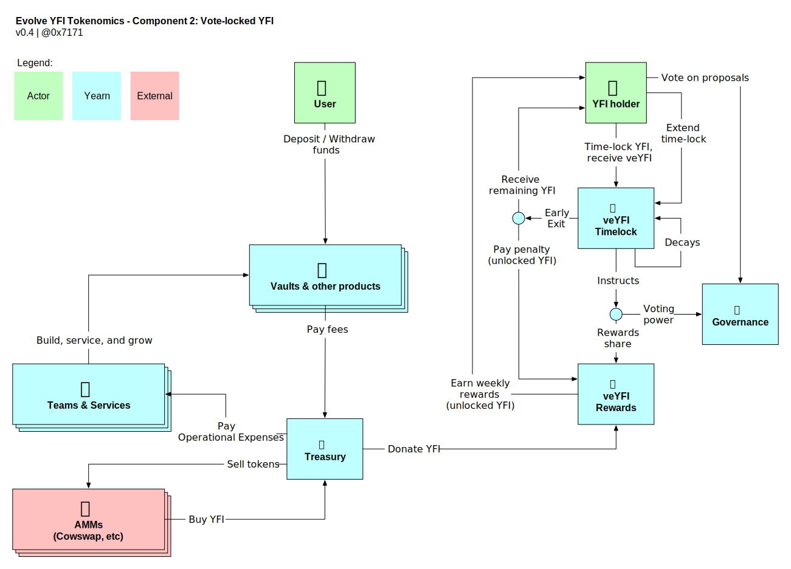
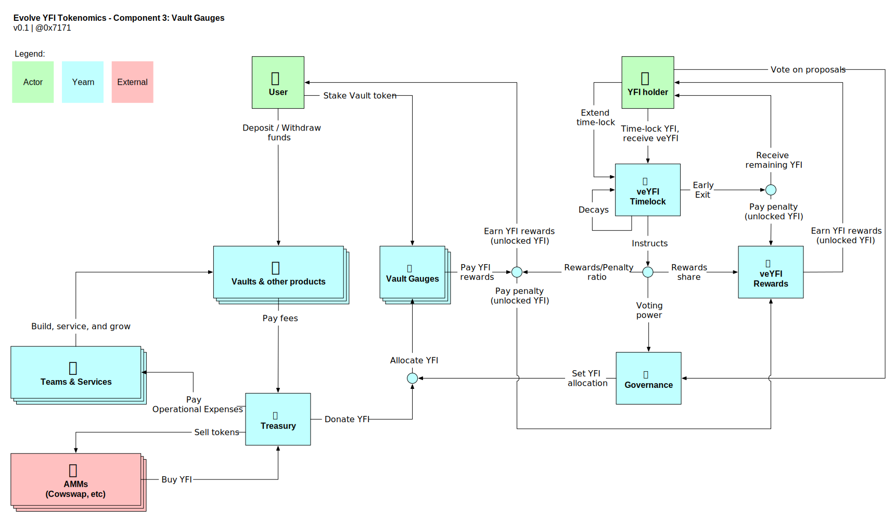

## Authors

@0xJiji, @banteg, daryllautk, HAtTip3675, @onlylarping, @vany365, @Wot_Is_Goin_On

## Summary

Evolve the role YFI plays in Yearn over four distinct phases, cementing the vision of the token as the fundamental foundation of governance.

### Status

**Voting:** This proposal is currently in the voting phase. [Cast your vote on Snapshot](https://snapshot.org/#/ybaby.eth/proposal/0x8f7417fa5565d9f46e16618503e8808c36d51b2a9e8217a68c632d7c090d69d9).
You can learn about our voting rules in YIP-55[1].

## Abstract

**If adopted**, this proposal seeks to:

1. Direct a portion of YFI that is bought back by the Treasury as a result of BABY [[1]](#References) as rewards to those YFI token holders who actively participate in Yearn Governance.
1. Evolve the role YFI plays in Yearn Governance through four distinct components. These build on top of each other and thus come in a particular order:
   - **1: xYFI.** Distribute YFI that's been bought back with Treasury tokens as rewards in a YFI vault.
   - **2: Vote-locked YFI.** Introduce ve-style locking of YFI (veYFI) for up to four years (exact max duration tbd), where a longer locking duration gives a greater share of voting power and share of YFI rewards. An early exit from the lock is possible by paying a penalty that is rewarded to the other locked token holders.
   - **3: Vault Gauges + Voting.** Introduce _vault gauges_ where vault depositors stake their vault tokens and earn YFI rewards according to their veYFI weight. YFI are allocated to gauges based on weekly governance votes.
   - **4: "Useful work" features.** Expand the duties and responsibilities of veYFI voters, and their locked YFI, in exchange for earning additional protocol rewards. Pending the tbc v3 vault design.
1. Give the mandate to Yearn Developers to roll out the above components at their discretion as and when they become feasible.
1. Restrict the YFI eligible to vote in Yearn Governance as only those staked in xYFI (from Phase 1 and onwards) or vote-locked in Yearn (from Phase 2 and onwards).

## Background

This section covers general information that readers may find useful in order to better understand the motivation and specification of the proposal. Namely the community exploration of various tokenomics ideas, the source and quantity of YFI rewards proposed to be used, some general information about Curve's ve-mechanic, and what was deliberately kept out of scope of this proposal.

### Call for tokenomics ideas

On October 6th 2021 there was a call for tokenomics ideas on Yearn’s governance forum[[2]](#References) that attracted over 5k views. Over 200 people completed a survey aimed to express the preferences of YFI tokenholders, results of which can be found in the References section.[[3]](#References) A discord chat gave those interested an opportunity to express their views. There were also multiple independent groups created with high degree of engagement, culminating in a signalling vote[[4]](#References) which aligns with the components of this proposal. This proposal attempts to bring together the discussions that have occurred over the last 2 months.

### State of Holdings & Buybacks

YIP-56: Buyback and Build (BABY)[[1]](#References) was adopted in early January 2021, instructing Treasury to buy back YFI with excess Yearn treasury tokens. A few weeks later, the yvDAI vault suffered an incident[[5]](#References) where 11m DAI were lost. The Treasury compensated those affected, making vault depositors whole. Since then, the Treasury has been on a path of recovering from this expense while at the same time saving for a potential market downturn and a prolonged bear market where a runway would be required during periods of lower protocol activity. While the details can be found in the quarterly financial reports[[6]](#References) the high level summary is that Yearn has gone from $11m in debt in February to $30m+ in liquid assets in November.[[7]](#References) Despite saving more than $40m, the Treasury has still been able to buy back **~300 YFI year to date** at a cost of ~$10m equivalent.[[8]](#References)

Now that the yvDAI debt has been paid off and the bear market buffer exists, Treasury expects to be able to direct **~$35-$45m** to YFI buy-backs on an annual run-rate basis assuming TVL and margins stay constant.

This would equate to 1,100-1,400 YFI per year at a YFI price of ~$30k, or somewhere around **100 YFI/month**. These bought back YFI could sustainably be used in a reward system, without impacting overall Treasury health negatively.

### Curve's ve-mechanism in a nutshell

An incomplete and very high level description of this mechanism is as follows:

- Users can lock CRV into veCRV for a duration of up to 4 years.
- Depending on the locking duration, users get different weights linearly: 4 years = 100% weight, 1 year = 25% weight, etc. The longer the lock, the more voting power and influence, and the more rewards can be earned.
- CRV rewards are distributed through _gauges_ in which users stake their Curve LP tokens. Each gauge gets allocated a different amount CRV to emit, based on weekly voting amongst veCRV holders.
- Based on their veCRV lock, users can boost their rewards of up to 2.5x when they claim CRV rewards from gauges.
- Unlike typical ERC-20 tokens, veCRV is non-transferable. This can be bypassed via wrapped derivatives such as the Yearn yveCRV vault or Convex's cvxCRV product.
- Each account can only have one single veCRV lock (of a certain duration).
- As the lock duration decays, so does the influence. If a user initially locked for 4 years for 100% weight, once 1 year has passed, their weight will be 75%. Users therefore have to constantly extend their locks (up to the maximum 4 years) in order to maintain their weight.

### Out of scope

The following topics were intentionally left outside of the scope of this proposal. Each one is potentially important and probably would be best served by its own stand alone proposal. They are also independent from what is proposed here, and could be added as extensions that build on top of the concepts covered in this proposal.

- **New YFI Emission.** The current proposal assumes no new YFI emission or minting. Emission could be attached to the components introduced in the phases, but is not an explicit requirement at this point.
- **Liquidity Mining Program.** A new liquidity mining program, whether funded by Treasury YFI assets or by new emission, is somewhat orthogonal to the topics covered in this proposal, and could be introduced with or without the concepts covered here. There are numerous trade offs to consider, better discussed in a dedicated proposal.
- **Unit bias conversions.**
- **Detailed specs of "useful work" features.** The v3 vault specification is still in the design and discovery phase. Whilst ideas such as vault insurance, safety modules, and vault allocations are mentioned in this context, it is premature to discuss specifics as such proposals are far from being ready to go live.

## Motivation

### Benefits

The following are some of the properties where the new tokenomics design is believed to improve over the previous state:

- **Incorporates YFI buybacks.** The mandate of YIP-56 is unchanged, the new design builds on top of and integrates the bought back YFI.
- **Is a sustainable ecosystem.** The new design does not create a drain on Treasury assets. Instead there are reinforcing flywheel effects where tokenomics rewards drive more TVL, that in turn drive more fees, that in turn drive more YFI buybacks, that is then used to reinforce the tokenomics.
- **Incentivizes a long term view on Yearn.** Token holders are motivated to support the protocol over the longer term rather than to speculate in the short term.
- **Disproportionately rewards those most loyal.** Weaker conviction holders effectively become diluted over time by the stronger conviction holders.
- **Limits rent-seeking benefits.** Over time as the components are introduced, the design avoids holders being rewarded for nothing. Or letting the largest holders accumulate more at the expense of the smaller holders.
- **Makes vaults more competitive.** Additional YFI earned from vault gauges are effectively added yield for depositors, in proportion to how dedicated they are in their support.
- **Motivates 3rd party protocols and DAOs to become YFI holders.** Yearn products are used as a yield components of a broader DeFi stack, and integrated in wallets and protocols. With this design, they have incentives to direct rewards to vaults and products they are using.
- **A seamless experience for integrators.** Participation is _optional_. This maintains the simplicity integrators have come to appreciate and makes it easy to reason about vault behavior. Only those who are motivated to do so can participate.

### Future possibilities

The proposal also opens up doors for potential further improvements that extend or build on top of these concepts, including:

- **yOptions program for contributors**, where contributors can acquire YFI at a discount based on how long these are locked into the protocol for.
- **Insurance/Backstop functionality**, where vaults could be insured against loss based on the amount of YFI locked, which in turn could be used to draw up stablecoin CDPs to repay users in catastrophic events.
- **New YFI Emission to veYFI holders**, where new YFI is minted according to some emission schedule and used to reward veYFI holders based on their lock duration.
- **Partnership program adopting veYFI to boost partner performance**, where partners can earn more based on their veYFI size and lock duration.

### Risks

- **Governance attacks,** where one or several actors accumulate sizable positions of YFI and can control rewards and decisions of the protocol. These risks exist today, and are mitigated somewhat by the limited supply of YFI and how the strong demand for YFI amongst Yearn contributors makes such attacks costly.
- **Not enough rewards to make locking attractive,** where vaults may not generate enough tokens to the Treasury to buy back enough YFI to motivate YFI holders to lock into veYFI. This has somewhat of a balancing effect, where as demand for locking decreases, so does the share of the rewards for those who actually do lock. If it's determined that the equilibrium does not lead to enough YFI being locked, additional YFI could be minted and rewarded to veYFI holders as previously mentioned in "Future possibilities".
- **YFI liquidity dries up.** Currently YFI is traded on multiple centralized and decentralized exchanges. As demand for using YFI elsewhere grows, there may be a lack of YFI/ETH LP supply in liquidity pools and lack of interest in general YFI market making, leading to YFI becoming more illiquid. In such an event, additional incentives may be required in order to ensure a healthy liquidity exists for trading in and out of YFI. The Treasury may also explore owning some of this liquidity outright.

### Alternatives considered

- OlympusPRO style designs
- Voters voting on fees
- YFI as a fee discount
- Distribute treasury YFI

## Specification

### 1. Spend bought back YFI in tokenomics rewards

- Use a portion of bought back YFI from BABY to finance a new tokenomics program.
- The 6,666 YFI that were minted as part of YIP-57: Funding Yearn's Future[[9]](#References) are not used for this purpose.

### 2. Evolve YFI through four components

_In required order:_

#### 2.1 xYFI

- A typical Yearn vault with YFI as a want token (potentially repurposing the existing yvYFI vault).
- Receives bought back YFI as rewards.
- Does not have any locking requirement.
- Does not charge fees.

#### 2.2 Vote-locked YFI

- Locking similar to the ve-style program of Curve.
- YFI can be locked up to 4 years into veYFI, which is non-transferable.
- The maximum lock duration is still tbd, but will be in the range of min 1 year, max 4 years.
- Locking duration gives the same linear weights, so if max duration is 4 years, this is 100%, and 2 years = 50% etc.
- Weights decay as the remaining lock duration decreases, and can be extended up to the max lock duration.
- Replaces xYFI, where a user _must_ have a veYFI lock in order to continue to earn rewards. No lock leads to no rewards. Maximum lock, continuously renewed, maximizes rewards.
- It's possible to exit the lock early, in exchange for paying a penalty that gets allocated to the other veYFI holders.
- Penalty size may be fixed (i.e. 50%), or may be depending on the remaining lock duration.

#### 2.3 Vault gauges + Voting

- Vault gauges allow vault depositors to stake their vault tokens and earn YFI rewards according to their veYFI weight.
- YFI are allocated to gauges based on weekly governance votes. Each gauge can get a different amount of bought back YFI to emit.
- Based on their veYFI lock, users can boost their rewards of up to 2.5x proportional to the amount of vault tokens deposited, when they claim YFI rewards from gauges. The greater the amount of veYFI, the more vault deposits can be boosted for the user.
- Inspired by Andre Cronje's initial design of Fixed Forex[[10]](#References), in order for gauge rewards to be claimed, the user must have a veYFI lock. Depending on their lock duration, they are entitled to a different share of gauge rewards: if max lock = 4 years, and user is locked for 4 years, they are entitled to 100% of their rewards, if user is locked for 2 years = 50% of rewards, if user has no lock = 0% of their rewards. The difference is paid as penalty to veYFI holders, as an additional source of yield.

#### 2.4 "Useful work" features

- This is driven by requirements of the yearn v3 vault design (still tbd).
- veYFI holders would be able to do useful work for the protocol and earn greater rewards as a result.
- Examples of useful work could be, but does not necessarily have to be: Configuring vault parameters, vault fees, strategy allocations, providing vault insurance, protocol backstop, and many other additional functionality.
- No useful work will be introduced without consulting YFI voters beforehand through YIPs.

### 3 Give Yearn Developers the mandate to roll out the above components

- Components can be introduced based on the requirements as set out here, with minor modifications as deemed necessary.
- Exact setting of parameters such as max lock duration and penalty system is left to be set at the discretion of the implementers.
- There is no requirement to add all four components, but components need to be in the order outlined as they build on each other.
- Timelines are at the discretion of the contributors doing the implementation work.

### 4 Restrict the YFI eligible to vote

- Once xYFI is introduced, only YFI staked is eligible to vote in Yearn Governance.
- Once veYFI is introduced, only veYFI is accepted voting power in Yearn Governance.

## Vote

[Cast your vote on Snapshot](https://snapshot.org/#/ybaby.eth/proposal/0x8f7417fa5565d9f46e16618503e8808c36d51b2a9e8217a68c632d7c090d69d9)

## References

1. https://gov.yearn.finance/t/yip-56-buyback-and-build/8929
1. https://gov.yearn.finance/t/call-for-ideas-yfi-tokenomics-revamp/11573
1. https://px2hc2blifd.typeform.com/report/yj5p5iIo/zIj0Alc03WFWfKTg
1. https://yearn.snapshot.page/#/proposal/0x783cb3d57dd59b2827f6a42967375f06504cc947ebaa3c0e495c7b29ffd47aea
1. https://github.com/yearn/yearn-security/blob/master/disclosures/2021-02-04.md
1. https://github.com/yearn/yearn-pm/tree/master/financials/reports
1. https://twitter.com/bantg/status/1461910717494398983
1. https://www.yfistats.com/financials/YFIBuybacks.html (Page 2)
1. https://gov.yearn.finance/t/yip-57-funding-yearns-future/9319
1. https://andrecronje.medium.com/fair-launches-decentralized-collaboration-and-fixed-forex-ab327a2e4fc4

## Copyright

Copyright and related rights waived via [CC0](https://creativecommons.org/publicdomain/zero/1.0/).

_Source: [Snapshot](https://snapshot.org/#/ybaby.eth/proposal/0x8f7417fa5565d9f46e16618503e8808c36d51b2a9e8217a68c632d7c090d69d9)_

## Information

| Name           | Value                                                                           |
| -------------- | ------------------------------------------------------------------------------- |
| Snapshot Space | [ybaby.eth](https://snapshot.org/#/ybaby.eth)                                   |
| Strategie(s)   | YFI, delegation                                                                 |
| Author         | wentokyo.eth                                                                    |
| IPFS           | https://cloudflare-ipfs.com/ipfs/QmNxWT18NXKcvJJVbR63bYHSbKenw1oKP95wuzLM8dicrc |
| Voting System  | Single choice voting                                                            |
| Start date     | Dec 23, 2021, 12:03 PM                                                          |
| End date       | Dec 28, 2021, 12:03 PM                                                          |
| Snapshot       | https://etherscan.io/block/13859920                                             |

## Results

| Result | Value |
| ------ | ----- |
| Yes    |  908 YFI (99.68%)     |
| No     |  2.9 YFI (0.32%)      |
